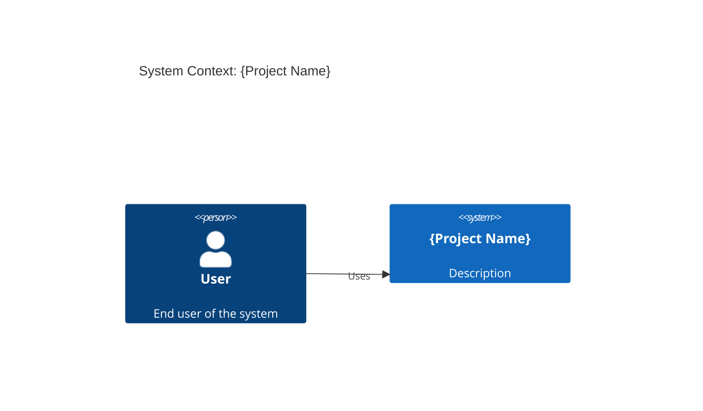

# /ai-dev-kit:init - Greenfield Initialization

Scaffold a new repository with the complete ai-dev-kit development workflow.

## Purpose

Set up a new project from scratch with:
- Complete directory structure
- Project configuration
- Architecture placeholders
- Specification templates
- Documentation for chosen stack
- Recommended plugins

## Prerequisites

- ai-dev-kit plugin installed
- Empty or minimal project directory
- Git initialized (or will be initialized)

## Process

### Step 1: Gather Project Information

Prompt user for project details:

```
Project Initialization

Project name: _______________
Description: _______________

Primary language:
[ ] TypeScript
[ ] Python
[ ] Go
[ ] Rust
[ ] Other: ___

Web framework:
[ ] Next.js
[ ] React
[ ] Vue
[ ] FastAPI
[ ] Express
[ ] Hono
[ ] None
[ ] Other: ___

Database:
[ ] PostgreSQL
[ ] MySQL
[ ] SQLite
[ ] MongoDB
[ ] None
[ ] Other: ___

ORM/Database client:
[ ] Drizzle
[ ] Prisma
[ ] SQLAlchemy
[ ] TypeORM
[ ] None
[ ] Other: ___

Testing framework:
[ ] Vitest
[ ] Jest
[ ] Pytest
[ ] Go test
[ ] None
[ ] Other: ___

Additional libraries (comma-separated): _______________
```

### Step 2: Initialize Git

```bash
# Initialize git if not already
if [ ! -d .git ]; then
  git init
  echo "Initialized git repository"
fi
```

### Step 3: Create Directory Structure

```bash
# Core directories
mkdir -p .claude/run-logs
mkdir -p .claude/run-reports
mkdir -p .claude/architecture
mkdir -p .claude/ai-dev-kit

# Architecture
mkdir -p architecture/c4
mkdir -p architecture/diagrams

# Specifications
mkdir -p specs/phases
mkdir -p specs/external-requests
mkdir -p specs/features

# Source (language-specific)
mkdir -p src

# Tests
mkdir -p tests

# Documentation
mkdir -p ai-docs/libraries
mkdir -p docs
```

### Step 3b: Sync Plugin Assets Locally

Use the ai-dev-kit CLI to sync plugin assets into `.claude/ai-dev-kit/`.

```bash
# Ensure local cache exists
mkdir -p .claude/ai-dev-kit

# Install the helper CLI if needed
if ! command -v ai-dev-kit >/dev/null 2>&1; then
  if command -v uv >/dev/null 2>&1; then
    uv tool install viper-dev-kit
  else
    echo "uv not found. Install uv or run ai-dev-kit sync manually later."
  fi
fi

# Sync assets from the plugin install or local repo
if command -v ai-dev-kit >/dev/null 2>&1; then
  ai-dev-kit sync --target .claude/ai-dev-kit
else
  echo "Fallback: set AI_DEV_KIT_SOURCE and run ai-dev-kit sync after installing uv."
fi
```

### Step 4: Configure Project Settings

Create `.claude/settings.json`:

```json
{
  "$schema": "https://json.schemastore.org/claude-code-settings.json",
  "permissions": {
    "allow": ["Read", "Write", "Execute"],
    "deny": []
  },
  "enabledPlugins": {
    "ai-dev-kit@ai-dev-kit": true
  }
}
```

Stack detection is automatic via the `library-detection` skill when manifest files are created.

### Step 5: Create AGENTS.md

Copy and customize the AGENTS.md template:

```markdown
# AGENTS.md - {Project Name}

> **Template Version**: 2.0.0
> **Last Updated**: {date}

## Project Context

{Project description}

### Stack
- **Language**: {language}
- **Framework**: {framework}
- **Database**: {database}
- **Testing**: {test_framework}

## Development Workflow

This project uses the ai-dev-kit development workflow:

1. **Explore**: `/ai-dev-kit:explore-architecture`
2. **Plan**: `/ai-dev-kit:plan-roadmap` and `/ai-dev-kit:plan-phase`
3. **Execute**: `/ai-dev-kit:execute-lane`
4. **Document**: `/ai-dev-kit:docs-find`

See the full workflow in the ai-dev-kit documentation.

## Quick Start

{customized based on stack}
```

Create symlinks:
```bash
ln -sf AGENTS.md CLAUDE.md
ln -sf AGENTS.md GEMINI.md
```

### Step 6: Create Specification Templates

Create `specs/ROADMAP.md`:

```markdown
# {Project Name} Roadmap

## Overview

{Brief project description and goals}

## Phases

### Phase 0: Foundation
- Set up project structure
- Configure development environment
- Establish coding standards

### Phase 1: Core Features
- {Feature 1}
- {Feature 2}
- {Feature 3}

### Phase 2: Enhancement
- {Enhancement 1}
- {Enhancement 2}

### Phase 3: Polish
- Documentation
- Testing
- Performance optimization
```

Create `specs/phases/P0-foundation.md` template:

```markdown
# P0: Foundation

## Overview
{Phase description}

## Swim Lanes
- Lane A: {description}
- Lane B: {description}

## Interface Contracts
See plan document after `/ai-dev-kit:plan-phase P0`.
```

### Step 7: Create Architecture Placeholders

Create `architecture/c4/context.md`:

```markdown
# System Context Diagram



## Description

{Describe the system context}
```

Create `architecture/README.md`:

```markdown
# Architecture

This directory contains C4 model diagrams for {project name}.

## Diagrams

- `c4/context.md` - System context (Level 1)
- `c4/container.md` - Container diagram (Level 2)
- `c4/component.md` - Component diagrams (Level 3)

## Generating Diagrams

Run `/ai-dev-kit:explore-architecture` to analyze the codebase
and generate/update these diagrams.
```

### Step 8: Deploy Documentation

Based on stack choices:

```
Documentation Setup

Deploying documentation for your stack:
- {language} core documentation
- {framework} documentation
- {database} documentation
- {orm} documentation
- {test_framework} documentation

Total: ~{size}

Proceed? [Y/n]
```

Copy relevant documentation from plugin's ai-docs.

### Step 9: Create .gitignore

```gitignore
# Dependencies
node_modules/
venv/
.venv/
__pycache__/

# Build
dist/
build/
*.egg-info/

# IDE
.idea/
.vscode/
*.swp
*.swo

# Environment
.env
.env.local
*.local

# AI Dev Kit runtime
.claude/run-logs/
.claude/run-reports/
.claude/settings.local.json

# OS
.DS_Store
Thumbs.db
```

### Step 10: Install Recommended Plugins

```
Installing recommended plugins...

- commit-commands
- security-guidance
- code-review
- pr-review-toolkit

Optional plugins:
[ ] plugin-dev (for extending ai-dev-kit)
[ ] hookify (for custom hooks)

Install optional? [y/N]
```

### Step 11: Initial Commit

```bash
git add .
git commit -m "Initial project setup with ai-dev-kit

- Set up directory structure
- Configure ai-dev-kit workflow
- Deploy stack documentation
- Create architecture placeholders
- Add specification templates

Stack: {language}, {framework}, {database}
"
```

## Output

Begin with a short control-plane reminder that Claude Code (ai-dev-kit plugin) orchestrates the workflow.
Encourage delegation to other agents via `/ai-dev-kit:delegate <provider> "<task>"` when they are better suited.

```
AI Dev Kit Initialization Complete

Project: {name}
Location: {path}
Date: {timestamp}

Structure Created:
.
├── .claude/
│   ├── settings.json
│   ├── run-logs/
│   └── run-reports/
├── ai-docs/
│   └── libraries/
│       ├── {lang}/
│       ├── {framework}/
│       └── ...
├── architecture/
│   ├── c4/
│   └── README.md
├── specs/
│   ├── phases/
│   ├── external-requests/
│   └── ROADMAP.md
├── src/
├── tests/
├── AGENTS.md
├── CLAUDE.md -> AGENTS.md
├── GEMINI.md -> AGENTS.md
└── .gitignore

Documentation: {N} libraries deployed
Plugins: 4 installed

Next Steps:
1. Run /ai-dev-kit:explore-architecture to analyze any existing code
2. Fill in specs/ROADMAP.md with your project phases
3. Create your first phase plan with /ai-dev-kit:plan-phase P0
4. Start development with /ai-dev-kit:execute-lane

Happy building!
```

## Usage

```
/ai-dev-kit:init
```

Or with options:
```
/ai-dev-kit:init --name "My Project"
/ai-dev-kit:init --stack typescript,react,postgresql
/ai-dev-kit:init --skip-plugins
/ai-dev-kit:init --minimal  # Skip docs, minimal structure
```
