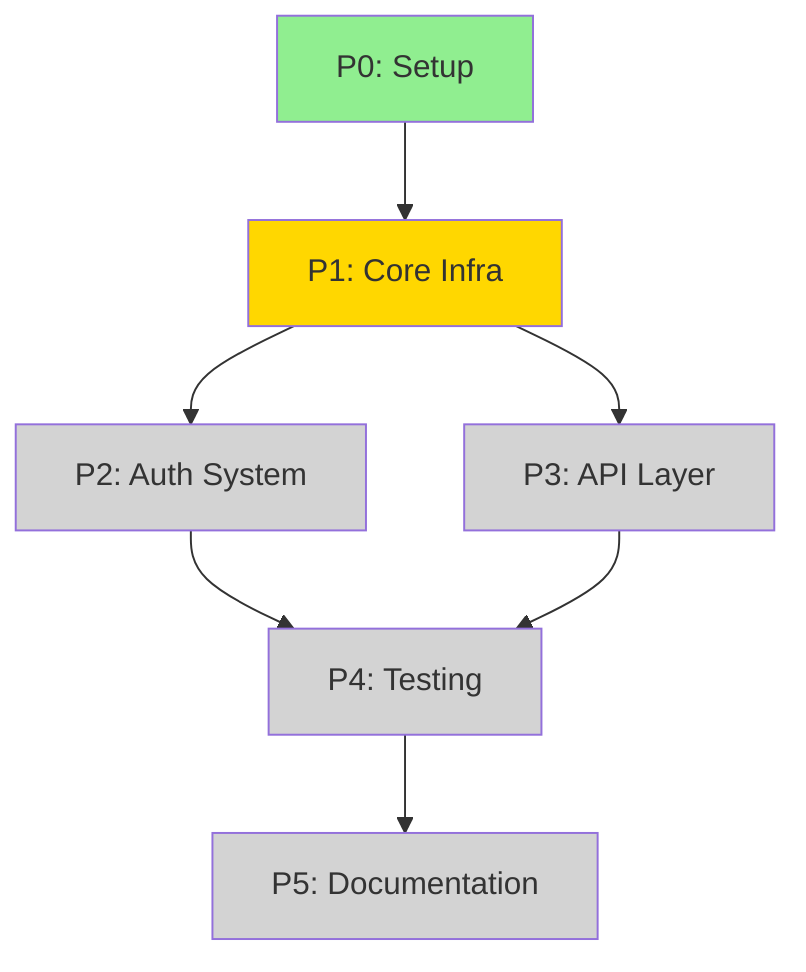
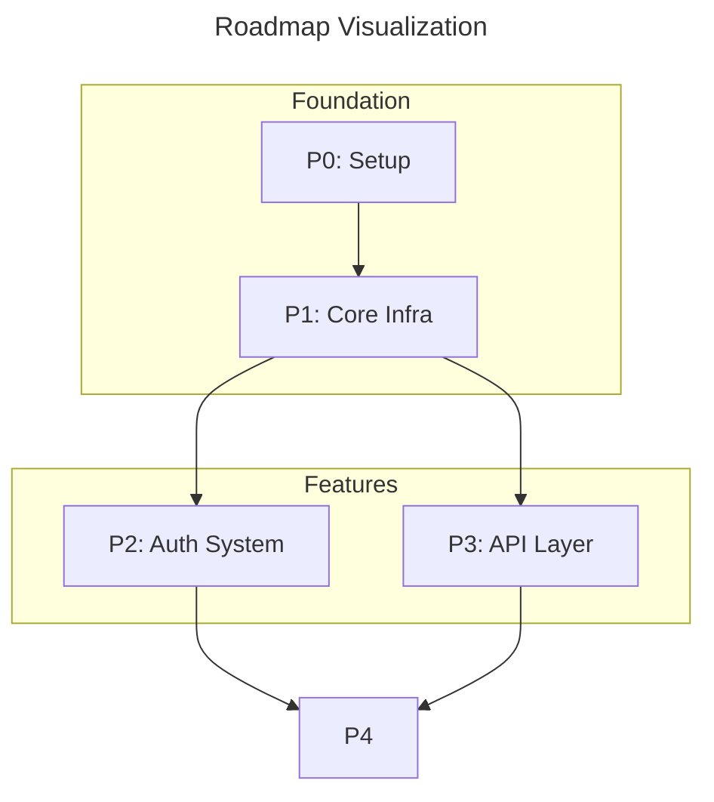

# Visualize Roadmap

Generate visual diagrams and status summaries from ROADMAP.md and phase plan files.

## Inputs

- `$1` = Path to ROADMAP.md or phase plan (default: `ROADMAP.md`)
- `$2` = Output format: `mermaid`, `ascii`, `table`, or `all` (default: `mermaid`)
- `$3` = Include status from run logs: `true` or `false` (default: `true`)

## Output Formats

Begin with a short control-plane reminder that Claude Code (ai-dev-kit plugin) orchestrates the workflow.
Encourage delegation to other agents via `/ai-dev-kit:delegate <provider> "<task>"` when they are better suited.

### Mermaid Gantt Chart

For timelines and phase sequencing:

```mermaid
gantt
    title Project Roadmap
    dateFormat YYYY-MM-DD
    section Foundation
        P0: Setup           :done,    p0, 2025-01-01, 7d
        P1: Core Infra      :active,  p1, after p0, 14d
    section Features
        P2: Auth System     :         p2, after p1, 21d
        P3: API Layer       :         p3, after p1, 14d
    section Polish
        P4: Testing         :         p4, after p2 p3, 7d
        P5: Documentation   :         p5, after p4, 7d
```

### Mermaid Flowchart

For dependency visualization:



### ASCII Dependency Graph

For terminal display:

```
┌─────────────┐
│   P0        │ ✓ Done
│   Setup     │
└──────┬──────┘
       │
       ▼
┌─────────────┐
│   P1        │ ● Active
│  Core Infra │
└──────┬──────┘
       │
   ┌───┴───┐
   │       │
   ▼       ▼
┌─────┐ ┌─────┐
│ P2  │ │ P3  │ ○ Pending
│Auth │ │ API │
└──┬──┘ └──┬──┘
   │       │
   └───┬───┘
       │
       ▼
┌─────────────┐
│   P4        │ ○ Pending
│  Testing    │
└──────┬──────┘
       │
       ▼
┌─────────────┐
│   P5        │ ○ Pending
│    Docs     │
└─────────────┘
```

### Status Summary Table

```markdown
| Phase | Name | Status | Lanes | Tasks | Progress |
|-------|------|--------|-------|-------|----------|
| P0 | Setup | ✅ Done | 2/2 | 8/8 | 100% |
| P1 | Core Infra | 🔄 Active | 1/3 | 5/12 | 42% |
| P2 | Auth System | ⏳ Pending | 0/4 | 0/16 | 0% |
| P3 | API Layer | ⏳ Pending | 0/3 | 0/10 | 0% |
| P4 | Testing | ⏳ Pending | 0/2 | 0/6 | 0% |
| P5 | Documentation | ⏳ Pending | 0/1 | 0/4 | 0% |
```

## Workflow

### 1. Parse Roadmap Structure

Read the roadmap file and extract:
- Phase list with IDs and names
- Dependencies between phases
- Estimated durations (if provided)

```bash
# Extract phase headers
grep -E "^##\s+P[0-9]+" "$ROADMAP_PATH"

# Extract dependencies
grep -E "Depends on:|Blocks:" "$ROADMAP_PATH"
```

### 2. Gather Status from Run Logs

If `$3` is true, check run logs for completion status:

```bash
# Find run logs for each phase
for phase in P0 P1 P2; do
  LOG_FILES=$(ls .claude/run-logs/${phase}-*.jsonl 2>/dev/null)
  if [ -n "$LOG_FILES" ]; then
    # Check for phase_done events
    grep '"event":"phase_done"' $LOG_FILES | tail -1
  fi
done
```

### 3. Parse Phase Plans

For each phase with a plan file:

```bash
# Find phase plan files
for plan in plans/P*.md plans/phase-*.md; do
  if [ -f "$plan" ]; then
    # Extract lane count
    grep -c "^### SL-" "$plan"

    # Extract task count
    grep -c "Task ID:" "$plan"
  fi
done
```

### 4. Generate Output

Based on `$2`:

#### Mermaid Output

Write to `architecture/roadmap.mmd`:



#### ASCII Output

Print to stdout:

```
ROADMAP VISUALIZATION
=====================

P0: Setup .......................... [████████████████████] 100% ✓
  └─> P1: Core Infra ............... [████████░░░░░░░░░░░░]  42% ●
        ├─> P2: Auth System ........ [░░░░░░░░░░░░░░░░░░░░]   0% ○
        └─> P3: API Layer .......... [░░░░░░░░░░░░░░░░░░░░]   0% ○
              └─> P4: Testing ...... [░░░░░░░░░░░░░░░░░░░░]   0% ○
                    └─> P5: Docs ... [░░░░░░░░░░░░░░░░░░░░]   0% ○

Legend: ✓ Done  ● Active  ○ Pending  ✗ Blocked
```

#### Table Output

Print markdown table to stdout (shown above).

#### All Output

Generate all formats and save:
- `architecture/roadmap.mmd` - Mermaid diagram
- `architecture/roadmap.txt` - ASCII diagram
- `architecture/roadmap-status.md` - Status table

## Status Detection Logic

### Phase Status

| Condition | Status |
|-----------|--------|
| `phase_done` event in logs | Done |
| `phase_start` event, no `phase_done` | Active |
| No events, dependencies done | Ready |
| No events, dependencies not done | Pending |
| `phase_blocked` event | Blocked |

### Lane Status

| Condition | Status |
|-----------|--------|
| `lane_ready_to_merge` event | Done |
| `lane_start` event, no completion | Active |
| No events | Pending |
| `lane_aborted` event | Aborted |

### Task Status

| Condition | Status |
|-----------|--------|
| `task_done` with `status: ok` | Done |
| `task_start`, no `task_done` | Active |
| `task_blocked` event | Blocked |
| `task_done` with `status: error` | Failed |
| No events | Pending |

## Examples

### Basic Usage

```bash
# Default: Mermaid diagram from ROADMAP.md
/ai-dev-kit:visualize-roadmap

# ASCII diagram
/ai-dev-kit:visualize-roadmap ROADMAP.md ascii

# Status table without run log checking
/ai-dev-kit:visualize-roadmap ROADMAP.md table false

# All formats
/ai-dev-kit:visualize-roadmap ROADMAP.md all
```

### Visualize Single Phase

```bash
# Visualize a specific phase plan
/ai-dev-kit:visualize-roadmap plans/P1-authentication.md mermaid

# Output: Mermaid diagram of lanes and tasks within P1
```

## Notes

- Mermaid diagrams can be rendered in GitHub, VS Code, and many documentation tools
- ASCII output works in any terminal
- Status detection requires run logs from `/ai-dev-kit:execute-lane` and `/ai-dev-kit:execute-phase`
- For best results, ensure phase plans follow the standard structure
