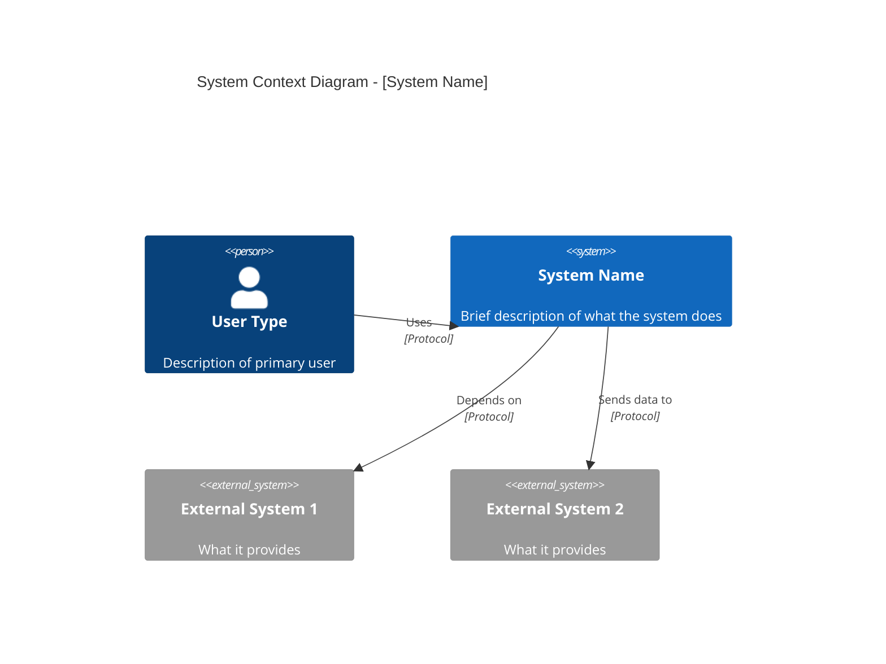
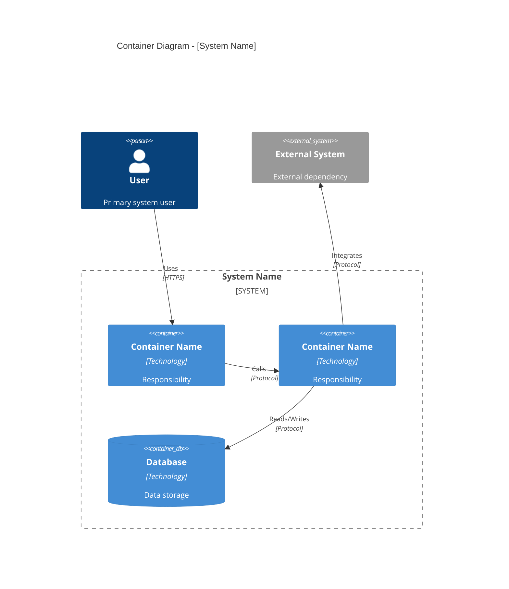
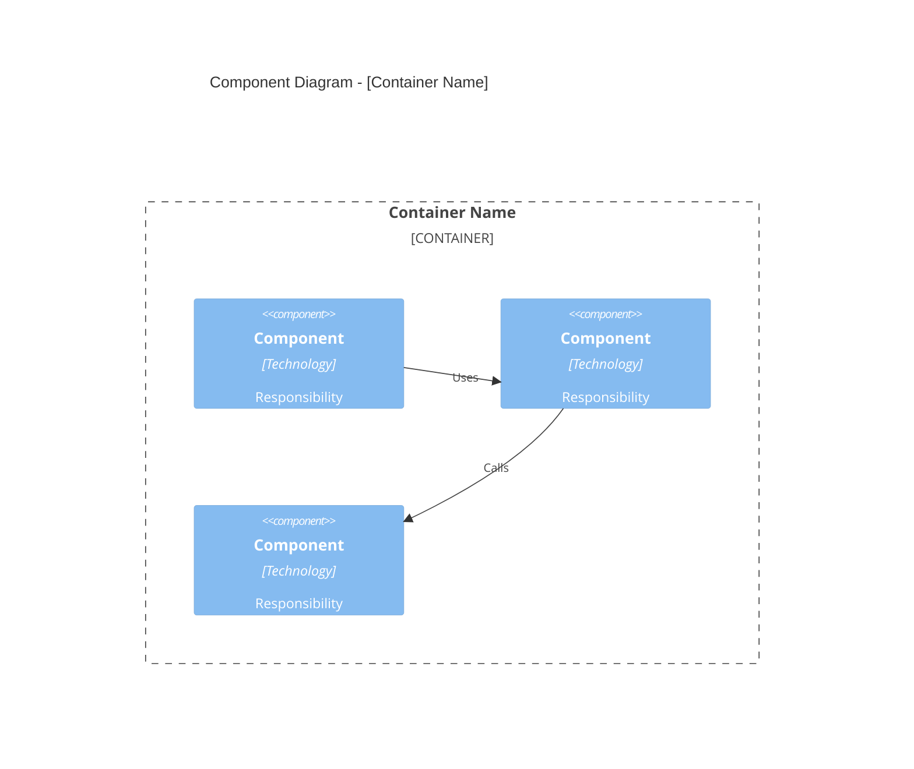
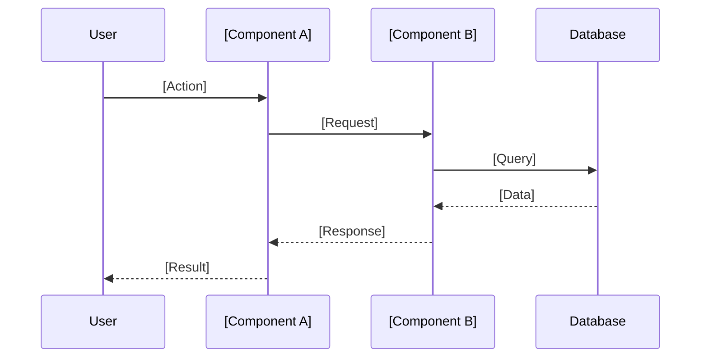
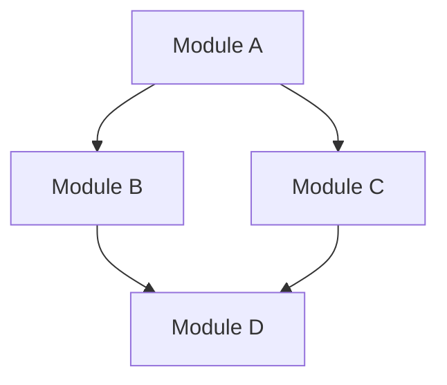

# CODEBASE Architecture Document

> **Project**: [Project Name]
> **Generated**: YYYY-MM-DD
> **Exploration Depth**: quick | standard | deep
> **Agent**: architecture-explorer

## Executive Summary

[2-3 paragraph overview of the codebase including:]
- What the system does (purpose)
- Key technologies used
- Overall architectural style
- Notable characteristics or concerns

## Technology Stack

### Languages
| Language | Version | Usage |
|----------|---------|-------|
| [Language] | [Version] | [Primary/Secondary, what for] |

### Frameworks
| Framework | Version | Purpose |
|-----------|---------|---------|
| [Framework] | [Version] | [What it's used for] |

### Key Dependencies
| Dependency | Version | Purpose |
|------------|---------|---------|
| [Package] | [Version] | [What it's used for] |

### Infrastructure
| Component | Technology | Purpose |
|-----------|------------|---------|
| Database | [Tech] | [What data it stores] |
| Cache | [Tech] | [What it caches] |
| Queue | [Tech] | [What jobs it processes] |

---

## C4 Model

### Level 1: System Context

[Description of the system in its environment]



**External Actors:**
| Actor | Type | Interaction |
|-------|------|-------------|
| [Name] | User/System | [How they interact] |

**System Boundaries:**
- [What's inside the system boundary]
- [What's outside the system boundary]

---

### Level 2: Container Diagram

[Description of the major runtime components]



**Container Inventory:**

| Container | Technology | Responsibility | Port/Entry |
|-----------|------------|----------------|------------|
| [Name] | [Tech] | [What it does] | [How to access] |

---

### Level 3: Component Diagrams

#### [Container 1 Name] Components

[Description of internal structure]



**Component Details:**

| Component | Location | Responsibility | Key Exports |
|-----------|----------|----------------|-------------|
| [Name] | `path/to/module` | [What it does] | [Main exports] |

#### [Container 2 Name] Components

[Repeat structure for each major container]

---

## Module Structure

### Directory Layout

```
project-root/
├── [dir]/              # [Purpose]
│   ├── [subdir]/       # [Purpose]
│   └── [subdir]/       # [Purpose]
├── [dir]/              # [Purpose]
└── [config files]      # [Purpose]
```

### Key Modules

#### `[module-path]`
- **Purpose**: [What this module does]
- **Exports**: [Main public API]
- **Dependencies**: [What it imports]
- **Consumers**: [What imports it]

#### `[module-path]`
[Repeat for key modules]

---

## Data Flow

### Primary User Flow



### Key Data Flows

| Flow | Trigger | Path | Data |
|------|---------|------|------|
| [Name] | [What triggers it] | A → B → C | [What data moves] |

---

## Architectural Patterns

### Patterns Identified

| Pattern | Where Applied | Evidence |
|---------|---------------|----------|
| [Pattern Name] | [Components/Areas] | [How it manifests] |

### Pattern Details

#### [Pattern Name]
- **Description**: [What the pattern is]
- **Implementation**: [How it's implemented here]
- **Files**: [Key files demonstrating pattern]

---

## Interfaces & APIs

### External APIs

| API | Type | Authentication | Documentation |
|-----|------|----------------|---------------|
| [Endpoint] | REST/GraphQL/gRPC | [Auth method] | [Link if available] |

### Internal Interfaces

| Interface | Location | Consumers |
|-----------|----------|-----------|
| `InterfaceName` | `path/to/file` | [What uses it] |

### Key Function Signatures

```typescript
// [Module/Component Name]
functionName(param: Type): ReturnType
anotherFunction(param: Type): Promise<ReturnType>
```

---

## Configuration

### Environment Variables

| Variable | Required | Default | Purpose |
|----------|----------|---------|---------|
| `VAR_NAME` | Yes/No | [Value] | [What it configures] |

### Configuration Files

| File | Purpose | Format |
|------|---------|--------|
| [filename] | [What it configures] | JSON/YAML/etc |

---

## Entry Points

### Application Entry Points

| Entry Point | File | Purpose |
|-------------|------|---------|
| Main | `path/to/main` | [What it starts] |
| CLI | `path/to/cli` | [What commands available] |

### Build/Dev Scripts

| Script | Command | Purpose |
|--------|---------|---------|
| [name] | `npm run X` | [What it does] |

---

## Testing Structure

### Test Organization

| Test Type | Location | Framework |
|-----------|----------|-----------|
| Unit | `path/to/tests` | [Framework] |
| Integration | `path/to/tests` | [Framework] |
| E2E | `path/to/tests` | [Framework] |

### Coverage Summary
- **Current Coverage**: [X%]
- **Coverage Gaps**: [Notable untested areas]

---

## Dependencies Graph

### External Dependencies by Category

#### Runtime Dependencies
| Package | Version | Purpose | Risk |
|---------|---------|---------|------|
| [pkg] | [ver] | [why needed] | Low/Med/High |

#### Development Dependencies
| Package | Version | Purpose |
|---------|---------|---------|
| [pkg] | [ver] | [why needed] |

### Internal Dependency Graph



### Circular Dependencies
- [ ] None detected
- [ ] [List any circular dependencies found]

---

## Identified Patterns & Anti-Patterns

### Strengths

| Strength | Evidence | Impact |
|----------|----------|--------|
| [Good practice] | [Where seen] | [Positive effect] |

### Areas of Concern

| Concern | Location | Severity | Recommendation |
|---------|----------|----------|----------------|
| [Issue] | [Where] | High/Med/Low | [What to do] |

---

## Security Considerations

### Authentication/Authorization
- **Method**: [How auth works]
- **Implementation**: [Where it's implemented]

### Sensitive Data
| Data Type | Storage | Protection |
|-----------|---------|------------|
| [Type] | [Where stored] | [How protected] |

### Security Concerns
- [Any security issues identified]

---

## Performance Characteristics

### Known Bottlenecks
| Area | Issue | Evidence |
|------|-------|----------|
| [Component] | [What's slow] | [How identified] |

### Optimization Opportunities
- [Potential optimization 1]
- [Potential optimization 2]

---

## Next Steps

After reviewing this document:

1. **For new development**: Run `/ai-dev-kit:plan-roadmap [your intent]`
2. **For technical debt**: Review [TECH-DEBT.md](./TECH-DEBT.md)
3. **For specific phase planning**: Run `/ai-dev-kit:plan-phase specs/ROADMAP.md "Phase N"`

---

## Appendix: Exploration Log

### Files Analyzed
- Total files: [N]
- Key files examined: [List of critical files]

### Tools Used
- [Tool/command used for analysis]

### Confidence Level
| Section | Confidence | Notes |
|---------|------------|-------|
| Context Diagram | High/Med/Low | [Any caveats] |
| Container Diagram | High/Med/Low | [Any caveats] |
| Component Diagrams | High/Med/Low | [Any caveats] |

---

*This document was generated by the architecture-explorer agent. Manual review and validation recommended.*
