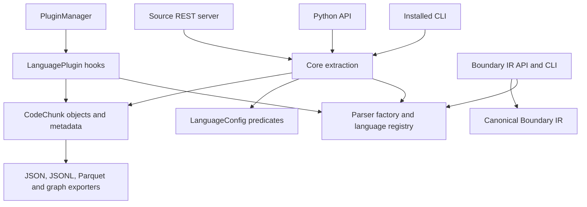
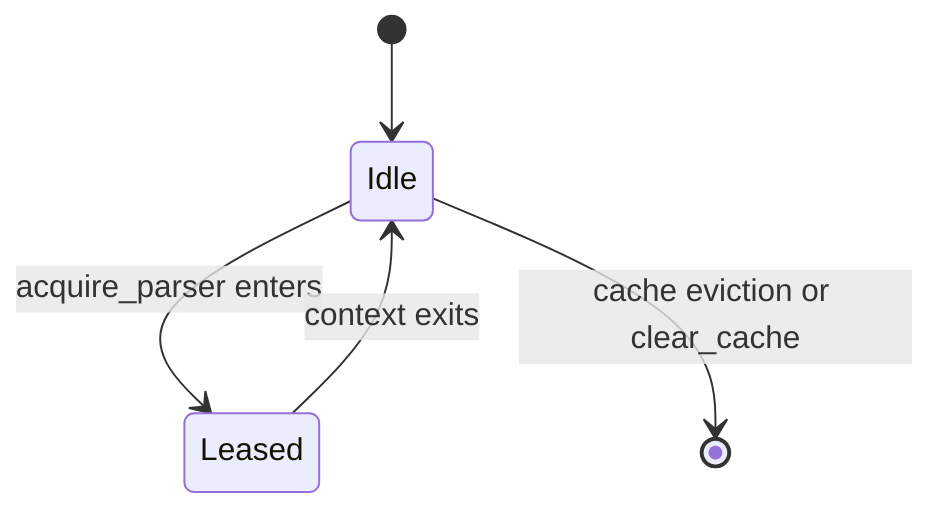
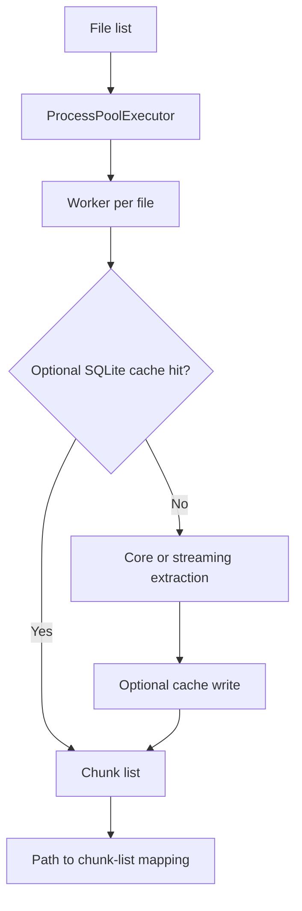

# Tree-sitter Chunker Architecture

## System Overview

The installed CLI and Python core APIs parse source into `CodeChunk` objects.
Boundary IR is a separate canonical interface for supported languages. The
source REST server wraps core extraction and is not included in the wheel.



## Core Components

| Component | Responsibility |
| --- | --- |
| `chunker/core.py` | File/text parsing, language-specific extraction, metadata and identities |
| `chunker/parser.py` | Lazy shared registry/factory initialization and parser access |
| `chunker/_internal/registry.py` | Language discovery/loading, including pack and native-library paths |
| `chunker/_internal/factory.py` | Thread-owned parsers and explicit exclusive parser leases |
| `chunker/languages/` | Core `LanguageConfig` registrations and explicit plugin classes |
| `chunker/plugin_manager.py` | Plugin discovery, registration and plugin-driven file extraction |
| `chunker/_internal/cache.py` | Explicit SQLite cache of extracted chunks |
| `chunker/parallel.py` | Process-based file/directory helpers with optional chunk caching |
| `chunker/streaming.py` | Memory-mapped file parsing and lazy chunk iteration |
| `chunker/export/`, `chunker/exporters/` | Serialization and export formats |

The default installed parser path uses the pinned language pack; it does not
require building one combined grammar library. The optional BAML companion has
separate provenance and version checks. Parser availability does not guarantee
verified extraction quality; see [language coverage](language-coverage.md).

## Data Flow

### Core Extraction

Core `chunk_file()` reads source, obtains the calling thread's parser, builds
an AST, and walks it using `language_config_registry` predicates. It attaches
metadata and identities and returns chunks. Core extraction does not
automatically consult the SQLite chunk cache or invoke registered plugins.

`PluginManager.chunk_file()` follows its registered `LanguagePlugin` hooks.
`ChunkerConfig` produces plugin settings which the application must explicitly
pass to that manager. The CLI's TOML `.chunkerrc` loader is separate. See
[configuration](configuration.md) and [plugin development](plugin-development.md).

### Parser Lifecycle

`get_parser()` retains a parser for the calling thread. Do not share that
mutable parser between threads. `return_parser()` is a compatibility no-op.
Use `acquire_parser()` for an explicit exclusive lease:

```python
from chunker.parser import acquire_parser

with acquire_parser("python") as parser:
    tree = parser.parse(b"def hello():\n    return 1\n")
    print(tree.root_node)
```



The factory may create a parser when none is idle. Configured leases are not
returned to the reusable cache. `clear_cache()` invalidates future thread-local
lookups; it does not revoke a parser already held by a caller. See
[parser concurrency](performance-guide/parser-concurrency.md).

### Parallel Processing and Caches

Python parallel helpers use `ProcessPoolExecutor`; CLI batch uses threads.
Use a main guard for process helpers with spawn or forkserver process startup.

Parallel helpers enable chunk caching by default at
`~/.cache/treesitter-chunker/ast_cache.db`, with no directory override. Disable
it with `use_cache=False` unless you manage invalidation of this shared cache.



The parser cache and SQLite chunk cache store different objects. `ASTCache`
stores extracted chunks, not native ASTs. Its keys do not include every parser
pin or extraction option; invalidate it when these change. Boundary incremental
caching has its own contract. See [performance](performance-guide.md) and
[Boundary IR](interface-boundary-spec.md).

Streaming still builds a full AST and retains source access while yielding
chunks. Measure elapsed time and peak memory on representative fixtures;
there is no guaranteed fixed speedup or bounded-RAM parsing contract.

## Extension Points

For core language support, inspect existing `LanguageConfig` registrations and
real-fixture tests. For plugin hooks, follow [plugin development](plugin-development.md).
Registering a plugin alone does not install a grammar. Never change parser
pins or build untrusted grammars to bypass compatibility checks.

Custom parser ranges require `tree_sitter.Range` objects with source byte
offsets and matching points; see [user guide](user-guide.md#custom-parser-configuration).
The legacy `timeout_ms` and logger settings are not applied on the pinned
runtime; this limitation is tracked in
[treesitter-chunker#355](https://github.com/Consiliency/treesitter-chunker/issues/355).

## Security Considerations

Core file APIs read caller-supplied paths. They do not enforce the source REST
server's confinement policy or a global source-size cap. The REST server
separately authenticates filesystem endpoints, confines relative paths to its
configured root, and caps request bodies at 1 MiB.

Tree-sitter uses native C code. Python lifetime management does not make all
native code memory-safe. Do not replace a loaded native library in place.
Library code follows parser ownership and lease conventions. Callers must not
share raw parsers between threads; caller-owned chunks remain mutable. The
legacy timeout field provides no parser deadline here.

## Troubleshooting Guide

Use [troubleshooting](troubleshooting.md) for parser availability, ABI checks,
empty extraction, configuration and cache diagnostics. Use the locked
environment and real fixtures before proposing a parser or grammar change.
