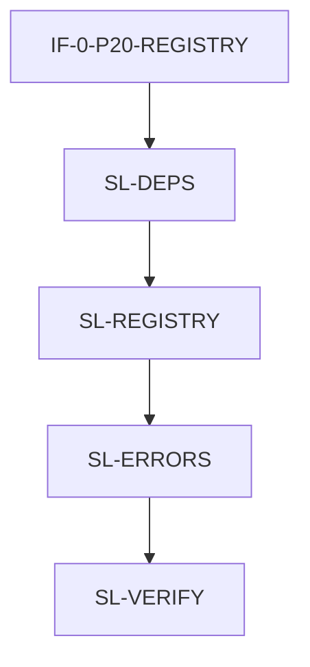

# P20: PyPI Install Experience

> **Control Plane**: Claude Code with ai-dev-kit plugin orchestrates this workflow.
> For specialized tasks, consider `/ai-dev-kit:delegate <provider> "<task>"`.

## Summary

This phase fixes the broken PyPI install experience where fresh installs fail with "No languages available" error. The solution adds `tree-sitter-language-pack` as a dependency and integrates it with the LanguageRegistry for out-of-the-box language support.

**Issue**: [#51](https://github.com/Consiliency/treesitter-chunker/issues/51)

**Ships**:
- Pre-compiled grammar support via tree-sitter-language-pack
- Zero-configuration language availability on fresh install
- Improved error messages with actionable guidance
- Fresh install verification in CI

---

## Interface Freeze Gates

### Core Interfaces (IF-0)
- [x] IF-0-P20-REGISTRY: LanguageRegistry interface for tree-sitter-language-pack integration
- [x] IF-0-P20-ERRORS: Error message format for grammar-related failures

### External Dependencies (IF-XR)
- [x] IF-XR-P20-LANGPACK: tree-sitter-language-pack available on PyPI (verified: v0.4.0+)

---

## Lane Index & Dependencies

```
- SL-DEPS -- Dependency Management
  - Depends on: IF-0-P20-REGISTRY
  - Blocks: SL-REGISTRY, SL-VERIFY
  - Parallel-safe: yes

- SL-REGISTRY -- Registry Integration
  - Depends on: IF-0-P20-REGISTRY, SL-DEPS
  - Blocks: SL-ERRORS, SL-VERIFY
  - Parallel-safe: no (shared files with SL-ERRORS)

- SL-ERRORS -- Error Handling
  - Depends on: IF-0-P20-ERRORS, SL-REGISTRY
  - Blocks: SL-VERIFY
  - Parallel-safe: no (shared files with SL-REGISTRY)

- SL-VERIFY -- Installation Verification
  - Depends on: SL-DEPS, SL-REGISTRY, SL-ERRORS
  - Blocks: none
  - Parallel-safe: yes
```

---

## A. Architectural Baseline & Component Catalog

### Files

| Path | Action | Owner |
|------|--------|-------|
| `pyproject.toml` | Modified | SL-DEPS |
| `chunker/_internal/registry.py` | Modified | SL-REGISTRY |
| `chunker/_internal/language_pack.py` | Added | SL-REGISTRY |
| `chunker/exceptions.py` | Modified | SL-ERRORS |
| `tests/test_fresh_install.py` | Added | SL-VERIFY |
| `tests/test_language_pack.py` | Added | SL-REGISTRY |

### Classes and Types

| Name | Path | Action | Description |
|------|------|--------|-------------|
| `LanguagePackProvider` | `chunker/_internal/language_pack.py` | Added | Wrapper for tree-sitter-language-pack |
| `LanguageRegistry` | `chunker/_internal/registry.py` | Modified | Add fallback to language pack |
| `LanguageNotFoundError` | `chunker/exceptions.py` | Modified | Improved error message |

### Functions

| Name | Path | Signature | Action |
|------|------|-----------|--------|
| `get_language_from_pack` | `chunker/_internal/language_pack.py` | `(name: str) -> Language \| None` | Added |
| `is_language_pack_available` | `chunker/_internal/language_pack.py` | `() -> bool` | Added |
| `get_language` | `chunker/_internal/registry.py` | `(self, name: str) -> Language` | Modified |

---

## B. Code-Level Interface Contracts

### IF-0-P20-REGISTRY: LanguageRegistry Integration

**File**: `chunker/_internal/registry.py`

```python
class LanguageRegistry:
    def get_language(self, name: str) -> Language:
        """Get a language by name.

        Resolution order:
        1. Compiled grammar in package data directory
        2. Compiled grammar in user cache
        3. tree-sitter-language-pack (if available)
        4. Raise LanguageNotFoundError with guidance

        Args:
            name: Language name (e.g., "python", "typescript")

        Returns:
            tree_sitter.Language object

        Raises:
            LanguageNotFoundError: If language not found anywhere
        """
```

**Owner**: SL-REGISTRY
**Consumers**: All chunking operations

### IF-0-P20-ERRORS: Error Message Format

**File**: `chunker/exceptions.py`

```python
class LanguageNotFoundError(ChunkerError):
    """Language not found with actionable guidance.

    Message format:
        Language '{name}' not found.

        To fix this:
        1. Install tree-sitter-language-pack: pip install tree-sitter-language-pack
        2. Or compile grammars: chunker-grammar setup {name}

        Available languages: {available_count}
        See: https://github.com/Consiliency/treesitter-chunker#grammars
    """
```

**Owner**: SL-ERRORS
**Consumers**: CLI, API, all error handlers

---

## C. Exhaustive Change List

| Item | Action | Owner | Rationale | Dependencies |
|------|--------|-------|-----------|--------------|
| `pyproject.toml` | Modified | SL-DEPS | Add tree-sitter-language-pack dependency | IF-XR-P20-LANGPACK |
| `chunker/_internal/language_pack.py` | Added | SL-REGISTRY | Language pack wrapper | IF-0-P20-REGISTRY, SL-DEPS |
| `chunker/_internal/registry.py` | Modified | SL-REGISTRY | Fallback to language pack | IF-0-P20-REGISTRY |
| `chunker/exceptions.py` | Modified | SL-ERRORS | Improved error messages | IF-0-P20-ERRORS |
| `tests/test_language_pack.py` | Added | SL-REGISTRY | Test language pack integration | SL-REGISTRY |
| `tests/test_fresh_install.py` | Added | SL-VERIFY | Verify fresh install works | All lanes |

---

## D. Swim Lanes

### SL-DEPS -- Dependency Management

**Scope**:
- Add tree-sitter-language-pack as optional dependency
- Verify compatibility with existing tree-sitter version
- Update package metadata

**Owned files**:
- `pyproject.toml`

**Interfaces provided**: None (configuration only)

**Interfaces consumed**:
- tree-sitter-language-pack PyPI package

**Tasks**:

| Task ID | Task Type | Depends On | Files in Scope | Tests Owned Files | Test Command(s) | Acceptance Criteria |
|---------|-----------|------------|----------------|-------------------|-----------------|---------------------|
| P20-SL-DEPS-01 | test | IF-0-P20-REGISTRY | - | tests/test_dependencies.py | pytest tests/test_dependencies.py | Test validates language-pack import |
| P20-SL-DEPS-02 | impl | P20-SL-DEPS-01 | pyproject.toml | tests/test_dependencies.py | pytest tests/test_dependencies.py | tree-sitter-language-pack added as dependency |
| P20-SL-DEPS-03 | verify | P20-SL-DEPS-02 | - | tests/test_dependencies.py | pytest tests/test_dependencies.py -v | All dependency tests pass |

---

### SL-REGISTRY -- Registry Integration

**Scope**:
- Create LanguagePackProvider wrapper
- Modify LanguageRegistry.get_language() with fallback chain
- Maintain backward compatibility

**Owned files**:
- `chunker/_internal/language_pack.py`
- `chunker/_internal/registry.py`

**Interfaces provided**:
- `get_language_from_pack(name: str) -> Language | None`
- `is_language_pack_available() -> bool`
- Modified `LanguageRegistry.get_language()`

**Interfaces consumed**:
- `tree_sitter_language_pack.get_language()`

**Tasks**:

| Task ID | Task Type | Depends On | Files in Scope | Tests Owned Files | Test Command(s) | Acceptance Criteria |
|---------|-----------|------------|----------------|-------------------|-----------------|---------------------|
| P20-SL-REGISTRY-01 | test | IF-0-P20-REGISTRY, SL-DEPS | - | tests/test_language_pack.py | pytest tests/test_language_pack.py | Tests for language pack wrapper |
| P20-SL-REGISTRY-02 | impl | P20-SL-REGISTRY-01 | chunker/_internal/language_pack.py | tests/test_language_pack.py | pytest tests/test_language_pack.py | LanguagePackProvider implemented |
| P20-SL-REGISTRY-03 | test | P20-SL-REGISTRY-02 | - | tests/test_registry_fallback.py | pytest tests/test_registry_fallback.py | Tests for registry fallback chain |
| P20-SL-REGISTRY-04 | impl | P20-SL-REGISTRY-03 | chunker/_internal/registry.py | tests/test_registry_fallback.py | pytest tests/test_registry_fallback.py | LanguageRegistry uses fallback |
| P20-SL-REGISTRY-05 | verify | P20-SL-REGISTRY-04 | - | tests/test_language_pack.py, tests/test_registry_fallback.py | pytest tests/test_language_pack.py tests/test_registry_fallback.py -v | All registry tests pass |

---

### SL-ERRORS -- Error Handling

**Scope**:
- Improve LanguageNotFoundError with actionable guidance
- Add available language count to error messages
- Include documentation links

**Owned files**:
- `chunker/exceptions.py`

**Interfaces provided**:
- Improved `LanguageNotFoundError` message format

**Interfaces consumed**:
- `LanguageRegistry.list_available_languages()`

**Tasks**:

| Task ID | Task Type | Depends On | Files in Scope | Tests Owned Files | Test Command(s) | Acceptance Criteria |
|---------|-----------|------------|----------------|-------------------|-----------------|---------------------|
| P20-SL-ERRORS-01 | test | IF-0-P20-ERRORS, SL-REGISTRY | - | tests/test_error_messages.py | pytest tests/test_error_messages.py | Tests for improved error messages |
| P20-SL-ERRORS-02 | impl | P20-SL-ERRORS-01 | chunker/exceptions.py | tests/test_error_messages.py | pytest tests/test_error_messages.py | Error messages include guidance |
| P20-SL-ERRORS-03 | verify | P20-SL-ERRORS-02 | - | tests/test_error_messages.py | pytest tests/test_error_messages.py -v | All error tests pass |

---

### SL-VERIFY -- Installation Verification

**Scope**:
- Create fresh install verification test
- Test all supported languages work without setup
- CI integration for install verification

**Owned files**:
- `tests/test_fresh_install.py`

**Interfaces provided**: None (verification only)

**Interfaces consumed**:
- All chunking APIs
- All supported languages

**Tasks**:

| Task ID | Task Type | Depends On | Files in Scope | Tests Owned Files | Test Command(s) | Acceptance Criteria |
|---------|-----------|------------|----------------|-------------------|-----------------|---------------------|
| P20-SL-VERIFY-01 | test | SL-DEPS, SL-REGISTRY, SL-ERRORS | - | tests/test_fresh_install.py | pytest tests/test_fresh_install.py | Fresh install tests exist |
| P20-SL-VERIFY-02 | verify | P20-SL-VERIFY-01 | - | tests/test_fresh_install.py | pytest tests/test_fresh_install.py -v --tb=short | Fresh install verification passes |

---

## E. Execution Notes

### Dependency Order



### Parallelization Constraints

1. **SL-DEPS** can start immediately after gates are frozen
2. **SL-REGISTRY** depends on SL-DEPS (needs tree-sitter-language-pack installed)
3. **SL-ERRORS** depends on SL-REGISTRY (needs to know available languages)
4. **SL-VERIFY** runs last (needs all other lanes complete)

### Serialization Points

- `chunker/_internal/registry.py` is modified by SL-REGISTRY only
- `chunker/exceptions.py` is modified by SL-ERRORS only
- No overlapping file ownership between lanes

---

## F. File-by-File Specification

### `pyproject.toml` -- Modified -- Owner: SL-DEPS

**Purpose**: Add tree-sitter-language-pack as dependency

**Key changes**:
```toml
dependencies = [
    ...
    "tree-sitter-language-pack>=0.4.0",  # Pre-compiled grammars
]
```

**Tests required**: Import test in test_dependencies.py

---

### `chunker/_internal/language_pack.py` -- Added -- Owner: SL-REGISTRY

**Purpose**: Wrapper for tree-sitter-language-pack with graceful fallback

**Key responsibilities**:
- Lazy import of tree-sitter-language-pack
- Graceful fallback if package not installed
- Language name normalization (typescript → TypeScript)

**Interfaces exposed**:
- `get_language_from_pack(name: str) -> Language | None`
- `is_language_pack_available() -> bool`
- `get_available_pack_languages() -> list[str]`

**Tests required**: test_language_pack.py

---

### `chunker/_internal/registry.py` -- Modified -- Owner: SL-REGISTRY

**Purpose**: Add fallback chain to LanguageRegistry.get_language()

**Key changes**:
- Import language_pack module
- Modify get_language() to try language pack as fallback
- Update discovery to include pack languages

**Tests required**: test_registry_fallback.py

---

### `chunker/exceptions.py` -- Modified -- Owner: SL-ERRORS

**Purpose**: Improve LanguageNotFoundError message

**Key changes**:
- Add actionable guidance to error message
- Include available language count
- Add documentation link

**Tests required**: test_error_messages.py

---

### `tests/test_fresh_install.py` -- Added -- Owner: SL-VERIFY

**Purpose**: Verify fresh install works without grammar compilation

**Key responsibilities**:
- Simulate fresh install environment
- Test common languages work immediately
- Verify error messages are helpful

**Tests required**: Self (this is the test file)

---

## H. Test Execution Plan

### Lane-Level Tests

| Lane | Test Command | Dependencies |
|------|--------------|--------------|
| SL-DEPS | `pytest tests/test_dependencies.py -v` | None |
| SL-REGISTRY | `pytest tests/test_language_pack.py tests/test_registry_fallback.py -v` | SL-DEPS |
| SL-ERRORS | `pytest tests/test_error_messages.py -v` | SL-REGISTRY |
| SL-VERIFY | `pytest tests/test_fresh_install.py -v` | All lanes |

### Cross-Lane Integration Tests

```bash
# Full integration test
pytest tests/test_fresh_install.py tests/test_language_pack.py -v

# Smoke test (quick verification)
python -c "from chunker import chunk_file; print('OK')"
```

### CI Integration

```yaml
# .github/workflows/test-fresh-install.yml
- name: Test Fresh Install
  run: |
    pip install .
    pytest tests/test_fresh_install.py -v
```

---

## J. Acceptance Criteria

| Criterion | Test | Pass Condition |
|-----------|------|----------------|
| Fresh PyPI install works | `pip install . && python -c "import chunker; chunker.chunk_file('test.py', language='python')"` | No error |
| All 36+ languages available | `tests/test_fresh_install.py::test_all_languages` | All languages parse successfully |
| Error messages are actionable | `tests/test_error_messages.py` | Message includes fix instructions |
| Backward compatibility | `pytest tests/` | All existing tests pass |
| No performance regression | Benchmark comparison | <10% slowdown on first load |

---

## Appendix: Implementation Notes

### tree-sitter-language-pack Integration

The `tree-sitter-language-pack` provides pre-compiled grammars for 165+ languages. Usage:

```python
from tree_sitter_language_pack import get_language

# Get a language object
ts_lang = get_language("typescript")

# Create parser
parser = Parser()
parser.language = ts_lang
```

### Language Name Mapping

Some language names differ between our codebase and tree-sitter-language-pack:

| Our Name | Pack Name |
|----------|-----------|
| typescript | TypeScript |
| javascript | JavaScript |
| cpp | Cpp |

The `LanguagePackProvider` handles this normalization.

### Fallback Behavior

```
1. Check package grammar directory (chunker/data/grammars/build/)
2. Check user cache (~/.cache/treesitter-chunker/build/)
3. Try tree-sitter-language-pack
4. Raise LanguageNotFoundError with guidance
```

This preserves backward compatibility while adding zero-config support.
