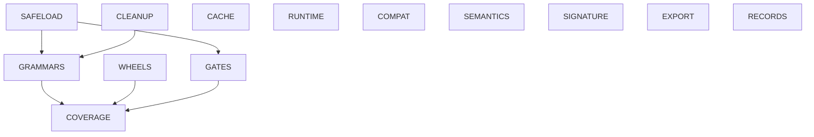

# Phase roadmap v3

## Context

Cleanup initiative, audited 2026-10-06 against current main. This is a new roadmap; v1/v2 remain historical inputs. See [complete inventory](../docs/development/backlog-inventory-20261006.md) for every issue, draft, planning artifact and disposition.

Closed fixed treesitter-chunker#124 and treesitter-chunker#107, and superseded draft treesitter-chunker#171. Added historical-record tracker treesitter-chunker#361 and independently tracked review findings. Accepted repairs treesitter-chunker#366, treesitter-chunker#374, treesitter-chunker#378 and treesitter-chunker#380 closed their associated issues with evidence. The inventory snapshot has 66 open issues, four held drafts and active drafts treesitter-chunker#364, treesitter-chunker#372 and treesitter-chunker#373. treesitter-chunker#69 reflects behavior/mutation acceptance.

5.2.0 is published; this quality/correctness campaign does not itself require another release. Planning uses existing source, merged verification and GitHub metadata; no fresh full-suite measurement is claimed.

## Architecture North Star

Preserve deterministic parsing and identities while making native loading, artifact publication, cache reuse, failure reporting and verification truthful. Reuse existing implementations; each behavioral repair has its own reviewed PR.

## Assumptions

- Supported pinned environment remains Tree-sitter 0.26 and language-pack 1.20.
- Native fixtures are compiled from reviewed repository sources; untrusted libraries are never loaded just to discover support.
- Worktrees use the operator’s private WORKTREE_ROOT. Existing held branches remain preserved.
- This roadmap is a planning proposal, not a ratified review or supplier-review admission.

## Non-Goals

No consumer lock updates, broker/authority edits, admitted train ledger/checkpoint changes, silent parser pin changes, hand-edited goldens, broad refactoring or release dispatch. No percentage gate that pins coverage outputs.

## Cross-Cutting Principles

- Priority P0: crashes, untrusted execution and destructive cleanup. P1: silent wrong results, broken public contracts, artifact integrity and unstable verification. P2: narrower semantics/exports/features. P3: records and further coverage.
- One issue/observable behavior cluster per PR; phase membership is scheduling, not a large combined patch. Detailed design is needed for shared safety, identity and persistence contracts; straightforward fixes can use a short PR plan.
- Use real parsers, real fixtures and named mutations. File new defects separately. Never merge unresolved blocking disagreement.
- Refresh each draft from then-current main in an owned worktree; rerun exact-head checks/review with a fresh bounded allowance. Honor original review caps: major redesign gets a reviewed successor, not endless rounds on a held draft.
- Manual Opus 5.5 TUI and Gemini 3.8 Flash review use tools and compact file pointers; Sol replaces Grok. Ratification requires independent review evidence; no oversized inline bundle.
- Comment before closing completed/superseded items. Do not treat age, overlapping modules, green CI or parent-PR merge as proof of acceptance.

## Top Interface-Freeze Gates

- IF-0-SAFELOAD-1 — Native provenance, isolated probe acknowledgment and immutable artifact contract.
- IF-0-CLEANUP-1 — Accepted cache writer/deleter ownership, staging and publication-recency contract.

## Phases

### Phase 1 — Trusted native grammar validation (SAFELOAD)

**Objective**

P0: Implement verified provenance and isolated post-parse acknowledgment in GrammarAnalyzer, SmartGrammarManager and UserGrammarTools. Reject empty, corrupt, wrong-symbol, null-language and premature-clean-exit artifacts without unapproved constructor side effects. This phase does not secure every native load in the repository.

**Exit criteria**

- [ ] EC-SAFELOAD-1 — Independently review the contract before implementation, then implement provenance, immutable artifact identity, isolated probing, acknowledgment and failure reporting across analyzer and legacy fallbacks. Contract approval alone neither produces the final IF gate nor closes an implementation issue.
- [ ] EC-SAFELOAD-2 — The implemented consumers pass real compiled-fixture falsifiers for constructor side effects and exit(0)/_exit(0), positive trusted parsing, and named mutations at the final reviewed head. Only then may treesitter-chunker#151, treesitter-chunker#164 and treesitter-chunker#165 close.

**Scope notes**

treesitter-chunker#165, treesitter-chunker#151, treesitter-chunker#164. Single lane: one independently landable shared admission/probe implementation PR carries tests and code together, preceded by independent design review. Keep one mechanism to prevent competing trust protocols. Retain draft treesitter-chunker#159 until its replacement is accepted. Existing local artifacts without an independently approved provenance pin fail closed; document migration for embedding callers without deriving trust from discovered bytes.
An independently landable metadata precursor in treesitter-chunker#366 covers treesitter-chunker#365 and treesitter-chunker#368: remove timestamp-derived releases/versions and prevent unknown versions satisfying numeric rules. Accept it before landing the shared probe; it does not produce the native IF gate.
Legacy compilation-date metadata is separately repaired in treesitter-chunker#380 for treesitter-chunker#376. Accept that precursor before native implementation acceptance; rebuilding or copying an artifact cannot establish its compilation date.

Load-path disposition: analyzer and legacy manager/tools are secured here. Registry ambient discovery and fallback loads, central GrammarValidator and CLI validation are explicitly unsecured until GRAMMARS integrates the shared contract. The exported low-level loader remains a caller-trusted primitive, never a discovery admission boundary. Modern installer publication and legacy replacement both belong to GRAMMARS. Serialize shared analyzer work with GATES and shared registry work with RUNTIME; unrelated RUNTIME/GATES fixes do not imply native admission protection.
Planning depth: Detailed design.

**Non-goals**

Unrelated changes.

**Key files**

- `chunker/languages/compatibility/grammar_analyzer.py`
- `chunker/_internal/grammar_management.py`
- `chunker/_internal/user_grammar_tools.py`

**Depends on**

- (none)

**Produces**

- IF-0-SAFELOAD-1 — Independently reviewed contract and accepted analyzer/legacy implementation; no repository-wide native safety claim.

**Spec closeout policy**

schema: spec_delta_closeout.v1; decision: canonical_spec_update; targets: native-validation-contract; evidence_paths: downstream-plan/PR/fixtures/mutations; redaction_posture: metadata_only; missing: blocker_class=contract_bug.

### Phase 2 — Cache deletion and auxiliary self-test safety (CLEANUP)

**Objective**

P0: Preserve recent files already present and published during cleanup, preserve symlink/junction boundaries, and keep every retained auxiliary self-test under a disposable root without deleting host grammars.

**Exit criteria**

- [ ] EC-CLEANUP-1 — Deterministic writer interleaving cannot delete a newly published file; static mixed-age and wholly expired directories have honest results.
- [ ] EC-CLEANUP-2 — A retained auxiliary suite uses an isolated home/root with no network-dependent failure simulation or operator grammar deletion; unsupported scenarios are explicitly retired.

**Scope notes**

treesitter-chunker#323, treesitter-chunker#324, treesitter-chunker#177, with separately filed coupled defects treesitter-chunker#369 (public fallback import) and treesitter-chunker#370 (validation-cache lost writes/containment). Two behavior areas: cache protocol/public fallback in core.py/cli.py/config.py/__init__.py, and auxiliary isolation in testing.py. Independently land static treesitter-chunker#324/treesitter-chunker#369 first; treesitter-chunker#177 is independent; then land the complete transaction repair treesitter-chunker#323/treesitter-chunker#370. Each bounded slice has its own active detailed plan, code, tests, docs, mutations and review. No intermediate PR claims concurrent safety. Freeze actual roots, whole-entry eviction, ordered publication generations, short writer transactions, staging/rollback ownership, validation JSON merging and no-follow deletion before protocol implementation. All participants obey one actual-root protocol; copied mtime cannot establish publication age. IF-0-CLEANUP-1 requires complete implementation/interleaving/platform/review acceptance.
Planning depth: Detailed for writer/deleter protocol; bounded plan for self-test isolation.
The complete transaction proposal was not accepted within its three-round design
allowance and is removed from active plan intake. phase-plan-v3-CLEANUP.md is a
held record with no executable lanes; the full proposal remains in immutable
design history. No transaction worker or IF-0-CLEANUP-1 is authorized.
Execute only the separately bounded static fallback,
auxiliary isolation and clean_cache=False flag contracts. The last is
treesitter-chunker#375 and is independent of transaction coordination.
Decompose into 2 lanes, one per behavior area, with a terminal evidence reducer; each repair uses a separate bounded detailed plan before implementation.

**Non-goals**

Unrelated changes.

**Key files**

- `chunker/grammar_management/core.py`
- `chunker/grammar_management/cli.py`
- `chunker/grammar_management/testing.py`
- `chunker/grammar_management/config.py`
- `chunker/grammar_management/__init__.py`

**Depends on**

- (none)

**Produces**

- IF-0-CLEANUP-1 — Accepted writer/deleter and staging contract consumed by grammar publication.
- Reviewed repairs with issue-specific evidence.

**Spec closeout policy**

schema: spec_delta_closeout.v1; decision: no_spec_delta; targets: issue-acceptance; evidence_paths: downstream-plan/PR/fixtures/mutations; redaction_posture: metadata_only; missing: blocker_class=contract_bug.

### Phase 3 — Safe replacement and native grammar commands (GRAMMARS)

**Objective**

P0/P1: Never overwrite a mapped grammar inode; validate staged artifacts before atomic publication, define reload/cache behavior, discover native platform suffixes in both tool stacks, and make status/exit results match validated reality.

**Exit criteria**

- [ ] EC-GRAMMARS-1 — Repeated install/update/load in a subprocess cannot crash, and each subsequent supported load parses the expected fixture revision.
- [ ] EC-GRAMMARS-2 — Linux/macOS/Windows registry and legacy tools find valid native libraries; wrong/null libraries fail; summary and rows agree; grammar info returns nonzero for missing/unusable grammar.

**Scope notes**

treesitter-chunker#162, treesitter-chunker#160, treesitter-chunker#117, treesitter-chunker#128, treesitter-chunker#120, treesitter-chunker#156, treesitter-chunker#362, treesitter-chunker#363. Decompose into 2 lanes: legacy replacement/suffix/info commands and exported registry/Click validation/health. Registry discovery/fallback, central validator and CLI validation integrate accepted SAFELOAD before claiming safe native admission. treesitter-chunker#362 inventories and integrates or retires additional loads in grammar/validator.py, grammar/download.py, grammar_manager.py and analyzer dependency inspection, including verdict reuse; the low-level loader stays explicitly caller-trusted. Both modern installer and legacy publication consume IF-0-CLEANUP-1 and require immutable replacement/reload evidence. Repair failed-update restoration separately under treesitter-chunker#363. Land treesitter-chunker#162 before suffix integration, then refresh treesitter-chunker#161; only then refresh treesitter-chunker#157. Keep treesitter-chunker#117 distinct from treesitter-chunker#160. Serialize core.py with CLEANUP/CACHE and registry.py with RUNTIME; no simultaneous writable ownership. Document migration for changed health and info exit codes.
Planning depth: Detailed replacement lifecycle; small suffix/display/status fixes inline.

**Non-goals**

Unrelated changes.

**Key files**

- `chunker/_internal/user_grammar_tools.py`
- `chunker/_internal/grammar_management.py`
- `chunker/grammar_management/core.py`
- `chunker/grammar_management/cli.py`
- `chunker/cli/grammar_commands.py`
- `chunker/_internal/registry.py`

**Depends on**

- SAFELOAD
- CLEANUP

**Produces**

- Reviewed repairs with issue-specific evidence.

**Spec closeout policy**

schema: spec_delta_closeout.v1; decision: no_spec_delta; targets: issue-acceptance; evidence_paths: downstream-plan/PR/fixtures/mutations; redaction_posture: metadata_only; missing: blocker_class=contract_bug.

### Phase 4 — Correct parallel cache identity and private storage (CACHE)

**Objective**

P1: Cached core/streaming results equal the requested uncached contract in either warming order and across output-affecting parser/grammar changes. An explicit cache root reaches every helper without home-cache writes.

**Exit criteria**

- [ ] EC-CACHE-1 — Real-process fixture tests compare both warming orders with uncached output and reject incompatible runtime/grammar cache entries.
- [ ] EC-CACHE-2 — Temporary-home fixtures prove caller-supplied cache directories confine all helper activity.

**Scope notes**

treesitter-chunker#358, treesitter-chunker#136. Decompose into 2 lanes: parallel result identity/private-cache API and grammar-helper cache propagation. Serialize any shared cache-format migration. Existing entries need explicit invalidation/compatibility guidance.
Planning depth: Detailed cache identity and migration.

**Non-goals**

Unrelated changes.

**Key files**

- `chunker/parallel.py`
- `chunker/_internal/cache.py`
- `chunker/grammar_management/core.py`
- `chunker/grammar_management/compatibility.py`

**Depends on**

- (none)

**Produces**

- Reviewed repairs with issue-specific evidence.

**Spec closeout policy**

schema: spec_delta_closeout.v1; decision: no_spec_delta; targets: issue-acceptance; evidence_paths: downstream-plan/PR/fixtures/mutations; redaction_posture: metadata_only; missing: blocker_class=contract_bug.

### Phase 5 — Complete the held wheel verifier (WHEELS)

**Objective**

P1: Verify supported pure/native wheels against an authoritative payload manifest, actual installed destinations, exact script names, root metadata/RECORD and dependency/tag requirements. Reject relocated collisions and all native-library variants in universal wheels.

**Exit criteria**

- [ ] EC-WHEELS-1 — Installed damaged verifiers reject missing modules/schema; collisions, wrong-case commands, nested/missing metadata and .so.1/case-variant native payloads are rejected with valid RECORD mutations.
- [ ] EC-WHEELS-2 — Unmodified built wheels install outside the checkout, import, parse a fixture and run both intended console entrypoints on supported platforms.

**Scope notes**

treesitter-chunker#155, treesitter-chunker#174, treesitter-chunker#175, treesitter-chunker#176, treesitter-chunker#182, treesitter-chunker#183, treesitter-chunker#184, treesitter-chunker#185. Decompose into 2 serialized behavior lanes: authoritative manifest/metadata and installed payload/entrypoint/native checks. Each lane owns its repair code and real-artifact tests together; builder.py ownership never overlaps concurrently. Refresh draft treesitter-chunker#180 from main only in its eventual repair worktree. Never merge a known incomplete verifier because old CI is green; retain each separately filed acceptance finding. Name the verifier used by releases separately from the legacy verify_build path and demonstrate the intended integration.
Land authoritative manifest repair first, then one behavior repair per PR with its regression and mutation in the same PR. Lanes coordinate work inside each PR; tests never land separately from their repair.
Planning depth: Detailed artifact manifest and install-layout contract.

**Non-goals**

Unrelated changes.

**Key files**

- `chunker/build/builder.py`
- `tests/test_supported_wheel_verification.py`
- `pyproject.toml`

**Depends on**

- (none)

**Produces**

- Reviewed repairs with issue-specific evidence.

**Spec closeout policy**

schema: spec_delta_closeout.v1; decision: no_spec_delta; targets: issue-acceptance; evidence_paths: downstream-plan/PR/fixtures/mutations; redaction_posture: metadata_only; missing: blocker_class=contract_bug.

### Phase 6 — Public failure semantics and first-use behavior (RUNTIME)

**Objective**

P1: Unsupported timeout/logger requests must not silently promise protection; slow first-use grammar acquisition has bounded configurable or verified-prewarm recovery; failed chunk files yield nonzero status and parseable structured stdout; replacement plugins take effect after first use.

**Exit criteria**

- [ ] EC-RUNTIME-1 — Actual cancellation or explicit unsupported-config rejection is observable; a controlled slow-download fixture proves actionable recovery with integrity verification.
- [ ] EC-RUNTIME-2 — Real CLI subprocesses cover quiet JSON/JSONL and mixed-success batches; real parser/plugin tests invoke the replacement hook after a warm instance cache.

**Scope notes**

treesitter-chunker#355, treesitter-chunker#357, treesitter-chunker#359, treesitter-chunker#360. Decompose into 2 lanes: parser/download configuration and CLI/plugin behavior. Define partial-batch failure policy explicitly, and keep artifact download deadlines separate from parse cancellation.
Document migration for callers requesting unsupported timeout/logger settings and callers relying on successful exit codes after failed chunking; test both old-input rejection and supported recovery.
Planning depth: Bounded plan for cancellation/download; CLI/plugin fixes inline.

**Non-goals**

Unrelated changes.

**Key files**

- `chunker/_internal/factory.py`
- `chunker/_internal/registry.py`
- `cli/main.py`
- `chunker/plugin_manager.py`

**Depends on**

- (none)

**Produces**

- Reviewed repairs with issue-specific evidence.

**Spec closeout policy**

schema: spec_delta_closeout.v1; decision: no_spec_delta; targets: issue-acceptance; evidence_paths: downstream-plan/PR/fixtures/mutations; redaction_posture: metadata_only; missing: blocker_class=contract_bug.

### Phase 7 — Reliable correctness checks and measured benchmarks (GATES)

**Objective**

P1/P2: Correctness runs assert outcomes under representative load without single-sample scheduler budgets; SIGINT waits for readiness; availability/symbol analysis distinguish deadline failure from unsupported grammars. Preserve intended benchmark performance targets in a controlled lane.

**Exit criteria**

- [ ] EC-GATES-1 — Readiness/interleaving-based checks catch functional regressions under coverage, and still run chunk-count/memory/export assertions when timing is slow.
- [ ] EC-GATES-2 — Controlled benchmark evidence preserves meaningful performance detection; loaded-run deadline failures report truthful causes rather than false support conclusions.

**Scope notes**

treesitter-chunker#131, treesitter-chunker#143, treesitter-chunker#194, treesitter-chunker#195, treesitter-chunker#200, treesitter-chunker#207, treesitter-chunker#322, treesitter-chunker#342. Decompose into 2 lanes with disjoint test files: streaming/parallel/performance and config/signal/grammar probes. One issue or tightly related test cluster per PR. Profile treesitter-chunker#195 before changing its target; production timeout changes are separate from test-only fixes.
treesitter-chunker#131 is accepted via treesitter-chunker#378; its coupled import precursor treesitter-chunker#377 is closed. The full benchmark runner's remaining obsolete API calls are treesitter-chunker#379 and require their own real-fixture contract. This partial delivery produces no whole-phase GATES acceptance.
Planning depth: Inline per test cluster; detailed only if profiling finds product work.

**Non-goals**

Unrelated changes.

**Key files**

- `tests/test_streaming.py`
- `tests/test_language_smoke.py`
- `tests/test_parallel.py`
- `tests/test_performance_advanced.py`
- `tests/test_config_advanced_scenarios.py`
- `tests/test_cli_integration_advanced.py`
- `chunker/languages/compatibility/grammar_analyzer.py`

**Depends on**

- SAFELOAD

**Produces**

- Reviewed repairs with issue-specific evidence.

**Spec closeout policy**

schema: spec_delta_closeout.v1; decision: no_spec_delta; targets: issue-acceptance; evidence_paths: downstream-plan/PR/fixtures/mutations; redaction_posture: metadata_only; missing: blocker_class=contract_bug.

### Phase 8 — Selection, persistence and version semantics (COMPAT)

**Objective**

P1: Candidate metadata belongs to its artifact; caller samples count as evidence; live and reopened DB selection agree after upserts; NULL history has explicit write/lookup semantics; global constraints are enforced or rejected; zero timing baselines preserve independent findings; numeric/ES/C++ versions and Python/Cargo declarations retain meaning.

**Exit criteria**

- [ ] EC-COMPAT-1 — Real local-artifact parses plus SQLite reopen tests prove attribution, replacement, fallback and constraint behavior; zero-baseline reports preserve independent regressions.
- [ ] EC-COMPAT-2 — Fixtures prove Go 1.10 > 1.9, C++98 precedes modern standards, ES range rejection, PEP 621 requires-python preference and selected Cargo rust-version export.

**Scope notes**

treesitter-chunker#133, treesitter-chunker#134, treesitter-chunker#135, treesitter-chunker#149, treesitter-chunker#170, treesitter-chunker#344, treesitter-chunker#345, treesitter-chunker#138, treesitter-chunker#141, treesitter-chunker#142, treesitter-chunker#146. Decompose into 2 lanes: serialized small PRs in grammar_management/compatibility.py and language schema/detectors. Keep separate tests for each issue; the ES interval repair in treesitter-chunker#332 does not fix GrammarVersion._compare_versions in treesitter-chunker#170.
Planning depth: Detailed for persistence/candidate constraints; detector and arithmetic fixes inline.

Define migration for existing duplicate/NULL database rows before upsert changes; test reopened legacy databases and document rejection or reconciliation without silent data loss.

**Non-goals**

Unrelated changes.

**Key files**

- `chunker/grammar_management/compatibility.py`
- `chunker/languages/compatibility/schema.py`
- `chunker/languages/compatibility/database.py`
- `chunker/languages/version_detection/`

**Depends on**

- (none)

**Produces**

- Reviewed repairs with issue-specific evidence.

**Spec closeout policy**

schema: spec_delta_closeout.v1; decision: no_spec_delta; targets: issue-acceptance; evidence_paths: downstream-plan/PR/fixtures/mutations; redaction_posture: metadata_only; missing: blocker_class=contract_bug.

### Phase 9 — Definition, scope and reference accuracy (SEMANTICS)

**Objective**

P2: Resolve Python declarations without cross-scope leakage; respect comprehension/default-expression walrus scope; enforce JavaScript lexical blocks; classify bindings separately from uses; generator context excludes body locals.

**Exit criteria**

- [ ] EC-SEMANTICS-1 — Checked-in real-parser positive/negative fixtures cover declarations, shadowing, binding/use roles and default-expression scope; a scope-boundary-bypass mutation fails.
- [ ] EC-SEMANTICS-2 — Generator summaries omit body-local content; Svelte is explicitly verified, unsupported or deferred with the missing runtime recorded.

**Scope notes**

treesitter-chunker#274, treesitter-chunker#278, treesitter-chunker#283, treesitter-chunker#289, treesitter-chunker#293, treesitter-chunker#294, treesitter-chunker#265. Decompose into 2 lanes: Python resolver/scope/reference and JavaScript resolver/context/reference. Svelte is a separate conditional PR: treesitter-chunker#265 requires a real parser exposing each_block; do not mock that node and claim runtime coverage.
Planning depth: Bounded scope design; simple generator summary inline.

**Non-goals**

Unrelated changes.

**Key files**

- `chunker/context/`
- `chunker/languages/svelte.py`

**Depends on**

- (none)

**Produces**

- Reviewed repairs with issue-specific evidence.

**Spec closeout policy**

schema: spec_delta_closeout.v1; decision: no_spec_delta; targets: issue-acceptance; evidence_paths: downstream-plan/PR/fixtures/mutations; redaction_posture: metadata_only; missing: blocker_class=contract_bug.

### Phase 10 — Signature metadata gaps (SIGNATURE)

**Objective**

P2: Go methods expose field_identifier names and actual parameters rather than receivers; C++ member declarations preserve qualifiers; Rust methods retain receiver and return information; Java/C#/Kotlin/Swift/PHP/Ruby get documented signature contracts.

**Exit criteria**

- [ ] EC-SIGNATURE-1 — Real method/declaration fixtures assert exact names, parameters, returns and qualifiers; skipping receiver handling or declaration dispatch breaks tests.
- [ ] EC-SIGNATURE-2 — Each added extractor has real fixtures, a named mutation and explicit supported AST forms; unsupported forms are documented.

**Scope notes**

treesitter-chunker#352, treesitter-chunker#353, treesitter-chunker#354, treesitter-chunker#367. Decompose into 2 lanes: Go/C++/Rust repairs and new language extractors partitioned by file. treesitter-chunker#354 is one umbrella with six independently reviewable language PRs; it does not subsume the existing-language defects. Rust receiver/return handling is its own real-fixture PR with a receiver-omission mutation.
Planning depth: Go/C++ inline; bounded per-language plans for new extractors.

**Non-goals**

Unrelated changes.

**Key files**

- `chunker/metadata/`

**Depends on**

- (none)

**Produces**

- Reviewed repairs with issue-specific evidence.

**Spec closeout policy**

schema: spec_delta_closeout.v1; decision: no_spec_delta; targets: issue-acceptance; evidence_paths: downstream-plan/PR/fixtures/mutations; redaction_posture: metadata_only; missing: blocker_class=contract_bug.

### Phase 11 — Graph identity and valid XML output (EXPORT)

**Objective**

P1: Distinct same-line-span chunks survive export with stable addressable identities; plain/yEd XML rejects or safely represents forbidden controls; key IDs including label remain unique.

**Exit criteria**

- [ ] EC-EXPORT-1 — Same-span real chunks survive graph export with valid endpoints and deterministic IDs; the old line-span-only identity mutation fails.
- [ ] EC-EXPORT-2 — Plain and yEd output have unique declarations and parseable XML, or a deliberate early actionable error for invalid characters.

**Scope notes**

treesitter-chunker#167, treesitter-chunker#168, treesitter-chunker#169. Decompose into 2 lanes: graph identity/endpoint mapping and XML/key validation. Serialize shared base mutations; three independently reviewed PRs. Graph IDs can affect consumers, so define migration before changing them.
Planning depth: Detailed identity compatibility; XML/key fixes inline.

**Non-goals**

Unrelated changes.

**Key files**

- `chunker/export/graph_exporter_base.py`
- `chunker/export/graphml_exporter.py`
- `chunker/export/graphml_yed_exporter.py`

**Depends on**

- (none)

**Produces**

- Reviewed repairs with issue-specific evidence.

**Spec closeout policy**

schema: spec_delta_closeout.v1; decision: no_spec_delta; targets: issue-acceptance; evidence_paths: downstream-plan/PR/fixtures/mutations; redaction_posture: metadata_only; missing: blocker_class=contract_bug.

### Phase 12 — Reconcile historical planning and residuals (RECORDS)

**Objective**

P3: One current evidence crosswalk distinguishes completed, superseded, contractual, pending and unsupported work; old unchecked boxes or failed publication metadata do not restart finished initiatives.

**Exit criteria**

- [ ] EC-RECORDS-1 — BAML, Unicode/wheels, determinism gate, P20 and v1/v2 plans have evidence-linked dispositions; completed fallback work is no longer presented as pending in current summaries.
- [ ] EC-RECORDS-2 — Overload resolution, four-language streaming parity, CLI/Parquet/config consolidation, mypy debt and v4 cleanup spec get current support/consumer dispositions; upstream BAML migration remains conditional on syntax and golden parity.

**Scope notes**

treesitter-chunker#361 and separately filed documentation-policy drift treesitter-chunker#371. Decompose into 2 lanes: planning lifecycle crosswalk and residual/consumer triage, partitioned by artifact. Keep runner/admitted ledgers unchanged. Reproduce residuals before separate implementation issues; no broad code cleanup. Restore maintainer notice/navigation bookkeeping under the existing release-hygiene contract, with its targeted test and strict-doc evidence.
Planning depth: Bounded audit plan.

**Non-goals**

Unrelated changes.

**Key files**

- `plans/manifest.json`
- `docs/development/xfail-inventory.md`
- `docs/development/traceability-matrix.md`
- `specs/active/`

**Depends on**

- (none)

**Produces**

- Reviewed repairs with issue-specific evidence.

**Spec closeout policy**

schema: spec_delta_closeout.v1; decision: canonical_spec_update; targets: planning-crosswalk/residual-summary; evidence_paths: downstream-plan/PR/fixtures/mutations; redaction_posture: metadata_only; missing: blocker_class=contract_bug.

### Phase 13 — Resume quality coverage after held contracts (COVERAGE)

**Objective**

P3: Measure then-current main, rank uncovered supported behavior by risk, and land one real-fixture behavior cluster with a named killed mutation per PR. Keep diagnostic coverage without a blanket percentage gate.

**Exit criteria**

- [ ] EC-COVERAGE-1 — Fresh full-suite report has exact scope, outcomes and hash; zero-covered interfaces/stubs.py gets an explicit supported-consumer disposition rather than a coverage exclusion.
- [ ] EC-COVERAGE-2 — Each new slice has observable contracts, real parsing, a named mutation, independent review and separately filed defects; old completed slices are not repeated.

**Scope notes**

treesitter-chunker#69. Decompose into 2 lanes: evidence/consumer inventory and independently owned test clusters. Blocked slices 15 and 17 need accepted repairs; slice 16 stays retired. Do not immediately add another long run of coverage PRs while higher-risk defects remain.
Planning depth: Existing detailed plan plus small new behavior plans.

**Non-goals**

Unrelated changes.

**Key files**

- `plans/detailed-coverage-contract-slices-20261001.md`
- `tests/`
- `spec_tests/`
- `scripts/run_ci_smoke.py`
- `scripts/run_platform_core.py`

**Depends on**

- WHEELS
- GRAMMARS
- GATES

**Produces**

- Reviewed repairs with issue-specific evidence.

**Spec closeout policy**

schema: spec_delta_closeout.v1; decision: no_spec_delta; targets: issue-acceptance; evidence_paths: downstream-plan/PR/fixtures/mutations; redaction_posture: metadata_only; missing: blocker_class=contract_bug.

## Phase Dependency DAG

## Execution Notes

Next phase: SAFELOAD — Trusted native grammar validation.
Next command: `codex-plan-phase specs/phase-plans-v3.md SAFELOAD`.

Plan the shared native contract first. CLEANUP is an independent P0 root. CACHE, WHEELS and RUNTIME can proceed with disjoint ownership. GATES may plan independent test repairs early, but its analyzer deadline repair treesitter-chunker#207 consumes IF-0-SAFELOAD-1; final phase acceptance depends on SAFELOAD. Serialize analyzer, registry, grammar CLI/compatibility files and CI selection scripts. GRAMMARS follows SAFELOAD and CLEANUP. Later semantic/export/signature work remains independently landable; its ordering does not depend on finishing every earlier phase.

RECORDS triage may start immediately even though lower priority. COVERAGE follows accepted held contracts and stable gates; stop repeating low-impact coverage additions while higher-risk defects remain. A future release requires separate preparation and dispatch plans under the current release-process spec.

Runtime 0.7.23 clears the old publication dependency. Recheck supported publication/review preflights. Supplier review still requires confirmed relocation, exact-head packet, four qualified heartbeat-only routes and fresh bounded allowance.

## Verification

Downstream plans must provide focused machine-checkable commands and an effective `automation.suite_command`, followed by repository Ruff, Black, mypy gate, CI smoke and affected platform checks from CONTRIBUTING.md. Native/path changes need standing Windows preflight and Linux/macOS/Windows exact-head CI. Artifact work requires an installed-wheel test outside the checkout.

Each repair proves its named fixture contract, fails under a named mutation, then passes after restoration. Destructive/native tests run only in isolated homes or subprocesses. Controlled benchmarks are separate from correctness budgets. Documentation changes use strict MkDocs/Sphinx builds to temporary directories.
Signature/semantic changes that intentionally alter Boundary IR require locked-stack golden regeneration and conformance checks from CONTRIBUTING.md; never edit goldens by hand. Pack-managed artifact acquisition has a distinct pinned supplier trust boundary; local candidates cannot borrow that trust.

For COVERAGE only, measure then-current main with the repo full-suite equivalent of `pytest tests spec_tests --cov=chunker --cov-report=term-missing --cov-report=json:<private-output>`; report scope, failures and digest without adding a fail-under gate. Operational evidence must name its artifact and use a runner-stamped amendment before it is treated as gate acceptance.

This run validates roadmap structure only.
